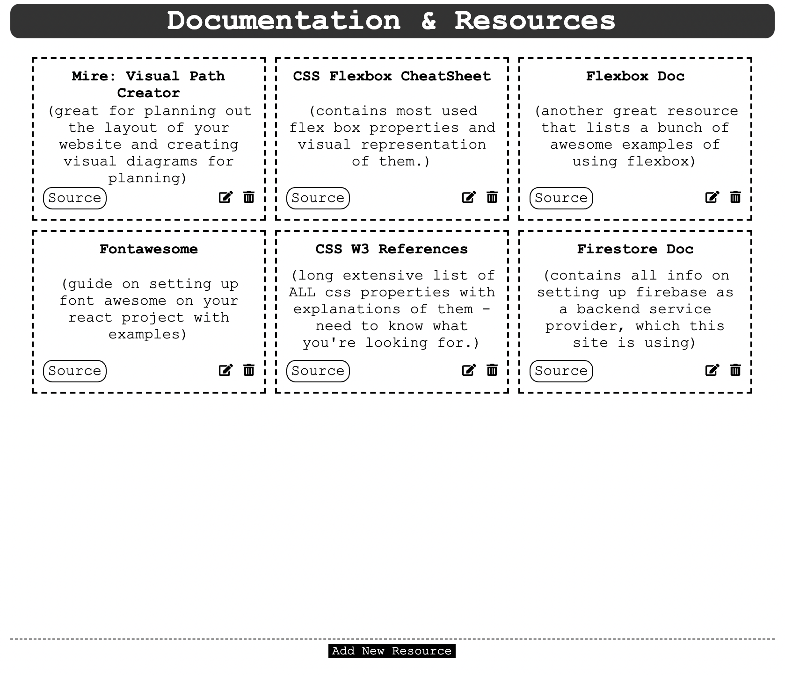

# Resource Collection Hub

Allows users to submit links to documentations, tools, articles, other resources, and more that are constantly used to develope websites. The website stores submissions on the cloud, and updates realtime with any resources added.

#### Built Using:

- [Firebase Database](https://console.firebase.google.com/)
  - Write new documents to database using user submitted info
  - Query database to show realtime data existing in firebase database.
- React Framework
  - lifecycle methods
  - class components
  - useRef references
  - functional components
  - state management
  - event handlers
- Javascript
- HTML
- CSS
- [FontAwesome Toolkit](https://fontawesome.com)

#### Pending Implementations (By Priority)

- Add a delete button where we are able to delete a resource.
- Add an edit button - where we are able to edit a resource.
- Add multiple folders - that represent different areas of production to filter through resources.
- Add note property "category", so that later we can have folders and filter the resources posted.
- User log in implementation. Program would then only allow logged in users to post and edit resources.
